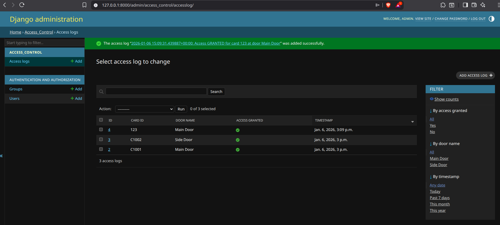
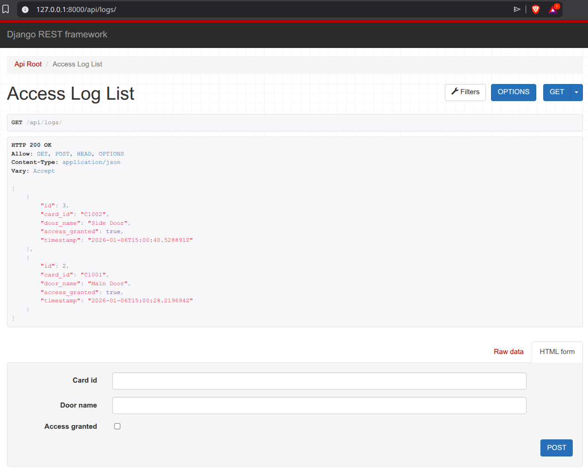
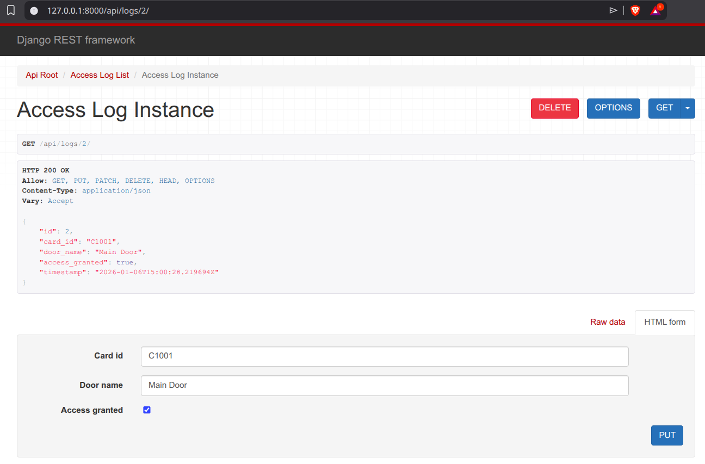

# Simple Access Control Log API

A Django REST Framework API for logging door access events with signal-based system logging.

## Features

- RESTful API endpoints for CRUD operations on access logs
- Automatic timestamp logging
- Signal-based system event logging using subprocess
- Filtering support for API queries
- Comprehensive unit tests

## Requirements

- Python 3.12+
- Django 6.x
- Django REST Framework
- django-filter

## Installation & Setup

### 1. Clone the Repository
```bash
git clone <repository-url>
cd access_control_project
```

### 2. Create Virtual Environment
```bash
python3 -m venv venv
source venv/bin/activate  # On Windows: venv\Scripts\activate
```

### 3. Install Dependencies
```bash
pip install -r requirements.txt
```

### 4. Run Migrations
```bash
python manage.py migrate
```

### 5. Run Development Server
```bash
python manage.py runserver
```

The application will be available at:
- **API:** `http://127.0.0.1:8000/api/logs/`
- **Admin:** `http://127.0.0.1:8000/admin/`
- **Root:** `http://127.0.0.1:8000/` (auto-redirects to API)

---

## Docker Support

### Build and Run with Docker
```bash
docker build -t access-control-api .
docker run -p 8000:8000 access-control-api
```

## UI Samples

### Admin Panel


### User Panel


### Single Log View



